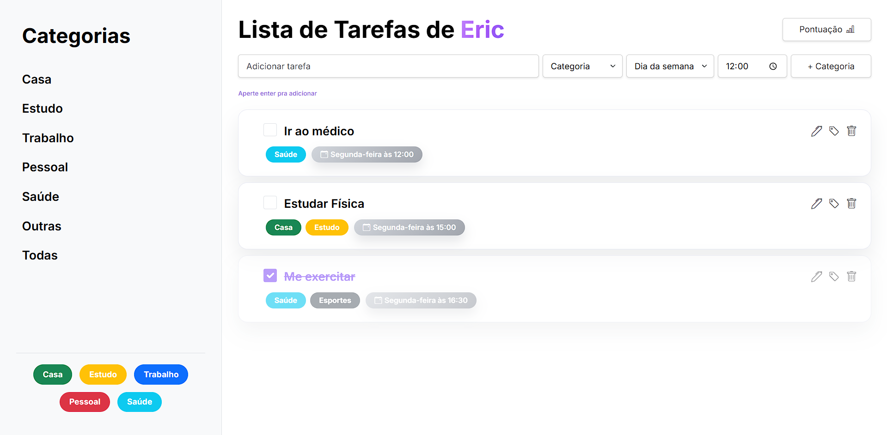

# Lista de Tarefas



Uma aplicação web moderna para gerenciamento de tarefas pessoais, construída com Angular. Organize suas atividades por categorias, defina prazos com dias e horários específicos, e acompanhe seu progresso através de um sistema de pontuação semanal.

> ⚠️ **Nota**: Esta aplicação foi desenvolvida exclusivamente para **desktop**. Não há versão responsiva para celular.

## 🎯 Funcionalidades

- **Gerenciamento Completo de Tarefas**: Crie, edite, delete e marque tarefas como concluídas
- **6 Categorias Pré-configuradas**: Casa, Estudo, Trabalho, Pessoal, Saúde, Outras (com opção de criar categorias personalizadas)
- **Agendamento por Dia da Semana**: Defina o dia da semana e horário para cada tarefa
- **Sistema de Pontuação Semanal**: Acompanhe seu progresso diário com variações
- **Reset Automático**: Todas as tarefas são limpas todo domingo às 23h59 para uma nova semana
- **Personalização com Nome**: Modal de boas-vindas que captura seu nome na primeira visita
- **Drag & Drop**: Reordene suas tarefas facilmente
- **Persistência Local**: Dados armazenados em IndexedDB (sem necessidade de servidor)
- **Interface Elegante**: Design moderno com tema lilás, prata e animações suaves
- **Digitação Animada**: Campo de entrada com placeholder que se digita automaticamente

## 🚀 Tecnologias Utilizadas

- **Angular 19.2** - Framework frontend
- **TypeScript** - Linguagem de programação
- **IndexedDB** - Armazenamento local de dados
- **Bootstrap 5.3** - Componentes UI
- **Bootstrap Icons** - Ícones
- **Angular CDK** - Funcionalidades avançadas (Drag & Drop)
- **RxJS** - Programação reativa

## 📦 Instalação

### Pré-requisitos
- Node.js (v20+)
- npm (v10+)

### Passos

1. Clone o repositório:
```bash
git clone https://github.com/ericdalaporta/task-list.git
cd task-list-main
```

2. Instale as dependências:
```bash
npm install
```

3. Inicie o servidor de desenvolvimento:
```bash
npm start
```

4. Abra seu navegador em `http://localhost:4200`

## 💡 Como Usar

### Adicionar uma Tarefa
1. Preencha o título da tarefa
2. Selecione uma categoria
3. Escolha o dia da semana
4. Defina o horário
5. Pressione Enter ou clique em "Adicionar"

### Gerenciar Categorias
- Use o botão **"+ Categoria"** para criar novas categorias personalizadas
- Clique em uma tarefa e depois no ícone de categorias para editar suas categorias

### Acompanhar Pontuação
- Clique no botão **"Pontuação"** no topo para visualizar seu desempenho
- Veja quantas tarefas você completou por dia
- Acompanhe a variação de tarefas entre dias consecutivos

### Completar Tarefas
- Marque o checkbox para completar uma tarefa
- Tarefas concluídas ficam com estilo atenuado
- Pontos são calculados automaticamente

### Reset Semanal
- Toda segunda-feira (domingo às 23h59), todas as tarefas são removidas automaticamente
- Isso permite focar em uma nova semana de objetivos
- Um aviso aparece na primeira visita explicando sobre o reset

## 🎨 Design & Cores

- **Lilás Forte** (#8b5cf6) - Cor primária
- **Lilás Pastel** (#d8b4fe) - Efeitos hover
- **Prata** (#d1d5db a #a1a5ad) - Badges de prazo
- **Cinza** (#9ca3af) - Elementos secundários
- **Fundo Branco** - Interface limpa

## 📁 Estrutura do Projeto

```
src/app/
├── components/
│   ├── main/                 # Componente principal
│   ├── task-item/            # Card da tarefa
│   ├── category-modal/       # Modal de categorias
│   ├── add-category-modal/   # Modal para criar categoria
│   ├── deadline-modal/       # Modal de prazos
│   └── sidebar/              # Barra lateral
├── services/
│   ├── db.service.ts         # Gerenciamento do IndexedDB
│   ├── category.service.ts   # Lógica de categorias
│   └── usuario.service.ts    # Gerenciamento do usuário
└── shared/
    ├── types.ts              # Tipos TypeScript
    ├── constants.ts          # Constantes
    └── formatters.ts         # Funções de formatação
```

## 🔄 Sistema de Pontuação

- **Primeira tarefa da semana**: Mostra número total de tarefas completas (ex: +3)
- **Demais dias**: Diferença em relação ao dia anterior (ex: +2, -1)
- **Reset automático**: Toda semana recomeça do zero

## 📄 Licença

MIT License - veja o arquivo LICENSE para detalhes.

## 👤 Autor

**Eric de Souza**

---

Desenvolvido com ❤️ para ajudar você a organizar sua vida de forma semanal e eficiente!


