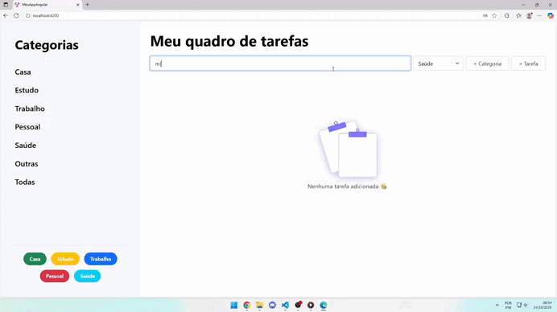

# 📋 Meu Quadro de Tarefas

Um aplicativo web moderno e intuitivo para gerenciar suas tarefas diárias com categorias personalizadas, persistência de dados e uma interface limpa e responsiva.




---

## 📋 Índice

- [Características](#-características)
- [Pré-requisitos](#-pré-requisitos)
- [Instalação](#-instalação)
- [Como Usar](#-como-usar)
- [Estrutura do Projeto](#-estrutura-do-projeto)
- [Tecnologias](#-tecnologias-utilizadas)
- [FAQ](#-faq)

---

## ✨ Características

- ✅ **CRUD Completo** - Adicione, visualize, edite e delete tarefas facilmente
- 🏷️ **Categorias Personalizáveis** - Crie suas próprias categorias e organize suas tarefas
- 💾 **Persistência com IndexedDB** - Suas tarefas são salvas automaticamente
- 📊 **Filtros Inteligentes** - Filtre por categoria ou visualize todas as tarefas
- 🎯 **Drag & Drop** - Reordene suas tarefas com um simples arrastar
- 📱 **Design Responsivo** - Funciona perfeitamente em desktop, tablet e mobile
- 🎨 **Interface Limpa** - Design minimalista com cores personalizadas (lilás #9370db)
- ⚡ **Performance Otimizada** - Carregamento instantâneo e operações suaves

---

## 🔧 Pré-requisitos

> ⚠️ **IMPORTANTE**: Use exatamente estas versões ou o projeto NÃO funcionará!

- **Node.js**: v20.16.0 (EXATAMENTE ESTA VERSÃO)
- **npm**: 10.8.1 (vem com o Node.js)
- **Angular CLI**: 19.2.18
- **Angular**: 19.2.15

### Verificar Versões Instaladas

```bash
node --version      # Deve ser v20.16.0
npm --version       # Deve ser 10.8.1
ng version          # Deve ser 19.2.18
```

---

## 📥 Instalação

### 1️⃣ Clone o Repositório

```bash
git clone https://github.com/seu-usuario/task-list.git
cd task-list-main
```

### 2️⃣ Instale as Dependências

```bash
npm install
```

Se encontrar problemas com versões, use:

```bash
npm install --legacy-peer-deps
```

### 3️⃣ Inicie o Servidor

```bash
npm start
```

O aplicativo abrirá automaticamente em `http://localhost:4200`

---

## 🎯 Como Usar

### ➕ Adicionar uma Tarefa

1. Digite o nome da tarefa no campo de entrada
2. Selecione uma categoria no dropdown
3. Clique no botão **"+ Tarefa"** ou pressione Enter

### 🏷️ Gerenciar Categorias

**Categorias Padrão:**
- Casa
- Estudo
- Trabalho
- Pessoal
- Saúde
- Outras (para categorias personalizadas)

**Criar Nova Categoria:**
1. Clique no botão **"+ Categoria"**
2. Digite o nome da nova categoria
3. Pressione Enter

### ✏️ Editar Tarefas

| Ação | Como Fazer |
|------|-----------|
| **Marcar como Concluída** | Clique no checkbox ao lado da tarefa |
| **Editar Categorias** | Clique no ícone de tag e arraste categorias |
| **Deletar Tarefa** | Clique no ícone de lixeira (com confirmação) |

### 🎚️ Reordenar Tarefas

- Arraste e solte as tarefas para reordenar
- A ordem é salva automaticamente no IndexedDB

### 🔍 Filtrar Tarefas

Clique nas categorias na barra lateral para filtrar:
- Clique em uma categoria específica para ver apenas suas tarefas
- Clique em **"Todas"** para ver todas as tarefas

---

## 🏗️ Estrutura do Projeto

```
src/
├── app/
│   ├── components/
│   │   ├── main/
│   │   │   ├── main.component.ts
│   │   │   ├── main.component.html
│   │   │   └── main.component.css
│   │   ├── sidebar/
│   │   │   ├── sidebar.component.ts
│   │   │   ├── sidebar.component.html
│   │   │   └── sidebar.component.css
│   │   ├── task-item/
│   │   │   ├── task-item.component.ts
│   │   │   ├── task-item.component.html
│   │   │   └── task-item.component.css
│   │   └── category-modal/
│   │       ├── category-modal.component.ts
│   │       ├── category-modal.component.html
│   │       └── category-modal.component.css
│   ├── services/
│   │   ├── db.service.ts         # IndexedDB operations
│   │   └── category.service.ts   # Category management
│   ├── app.component.ts
│   ├── app.component.html
│   ├── app.routes.ts
│   └── app.config.ts
├── styles.css                    # Estilos globais
├── main.ts                       # Entry point
└── index.html
```

### 📁 Descrição dos Diretórios

| Pasta | Responsabilidade |
|-------|-----------------|
| `components/main` | Componente principal com lógica CRUD |
| `components/sidebar` | Barra lateral com lista de categorias |
| `components/task-item` | Componente individual de tarefa |
| `components/category-modal` | Modal para editar categorias de tarefa |
| `services/db.service` | Operações com IndexedDB (persistência) |
| `services/category.service` | Gerenciamento e persistência de categorias |

---

## 🛠️ Tecnologias Utilizadas

### Frontend
- **Angular 19.2** - Framework web reativo
- **TypeScript 5.x** - Linguagem com type safety
- **Bootstrap 5.3** - Framework CSS responsivo
- **Angular CDK 19** - Componentes avançados (Drag & Drop)

### Armazenamento
- **IndexedDB** - Banco de dados no navegador (tarefas)
- **localStorage** - Armazenamento simples (categorias)

### Build & Deploy
- **Angular CLI 19.2.18** - Ferramenta de desenvolvimento
- **Webpack** - Module bundler

---

## 💾 Persistência de Dados

### IndexedDB (Tarefas)
```typescript
{
  id: number,           // ID único (auto-incrementado)
  titulo: string,       // Nome da tarefa
  categorias: string[], // Array de categorias
  completa: boolean,    // Status de conclusão
  dataCriacao: string,  // ISO timestamp
  ordem: number         // Ordem de exibição
}
```

### localStorage (Categorias)
```json
["Casa", "Estudo", "Trabalho", "Pessoal", "Saúde", "Minha Categoria"]
```

---

## 🚀 Build para Produção

```bash
npm run build
```

Arquivos gerados em: `dist/meu-app-angular/`

---

## 🐛 Troubleshooting

### "npm install não funciona"
```bash
# Tente com legacy peer deps
npm install --legacy-peer-deps
```

### "Tarefas não estão sendo salvas"
- Verifique se IndexedDB está habilitado
- Abra DevTools (F12) → Application → IndexedDB
- Limpe o cache: Ctrl+Shift+Delete

### "Categorias desapareceram"
- localStorage pode estar desabilitado
- Tente usar navegador em modo normal (não privado)
- Verifique DevTools → Application → localStorage

### "Erro 'Cannot find module'"
```bash
# Delete node_modules e reinstale
rm -r node_modules
npm install --legacy-peer-deps
```

### "Porta 4200 já está em uso"
```bash
# Use outra porta
ng serve --port 4201
```

---

## 📱 Compatibilidade de Navegadores

| Navegador | Suporte | Versão |
|-----------|---------|--------|
| Chrome | ✅ Excelente | 120+ |
| Firefox | ✅ Excelente | 121+ |
| Safari | ✅ Bom | 17+ |
| Edge | ✅ Excelente | 120+ |
| Mobile (Chrome) | ✅ Bom | 120+ |
| Mobile (Safari) | ✅ Bom | 17+ |

---

## 💡 Melhorias Futuras

- [ ] Datas de vencimento nas tarefas
- [ ] Níveis de prioridade
- [ ] Tags personalizadas
- [ ] Exportar em CSV/JSON
- [ ] Sincronização com nuvem
- [ ] Notificações locais
- [ ] Temas personalizáveis

---

## 📄 Licença

MIT License - Veja [LICENSE](LICENSE) para detalhes

---

## 👨‍💻 Desenvolvedor

Desenvolvido com ❤️ usando Angular

---

## 📞 Suporte

Encontrou um bug? Abra uma [issue](https://github.com/seu-usuario/task-list/issues)

---

**Aproveite seu novo gerenciador de tarefas! 🚀**
